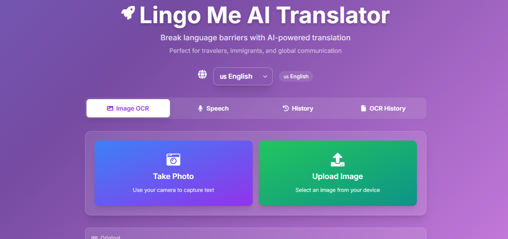

# 🚀 Lingo Me AI Translator

**Break language barriers with AI-powered translation**

Perfect for travelers, immigrants, and global communication



## ✨ Features

- **📸 Image OCR Translation**: Capture or upload images to extract and translate text
- **🎙️ Speech Translation**: Real-time voice translation for seamless conversations
- **📝 Text Translation**: Traditional text-to-text translation with AI accuracy
- **📱 Multi-Modal Input**: Camera capture, image upload, and voice input support
- **🌍 Multi-Language Support**: Supports 25+ languages including:
  - Arabic (ara), Bulgarian (bul), Chinese Simplified (chs), Chinese Traditional (cht)
  - Croatian (hrv), Czech (cze), Danish (dan), Dutch (dut), English (eng)
  - Finnish (fin), French (fre), German (ger), Greek (gre), Hungarian (hun)
  - Korean (kor), Italian (ita), Japanese (jpn), Polish (pol), Portuguese (por)
  - Russian (rus), Slovenian (slv), Spanish (spa), Swedish (swe), Thai (tha)
  - Turkish (tur), Ukrainian (ukr), Vietnamese (vnm)
- **📋 Translation History**: Keep track of your previous translations
- **🔍 OCR History**: Access your image translation history
- **🎯 Auto Language Detection**: Automatically detects source language for optimal translation

## 🛠️ Technology Stack

- **Frontend**: React.js with modern UI components
- **OCR Engine**: OCR.space API with Engine 2 for enhanced accuracy
- **Translation**: AI-powered translation services
- **Image Processing**: Advanced image preprocessing for better OCR results
- **Speech Recognition**: Web Speech API integration
- **Styling**: Modern CSS with responsive design

## 🚀 Getting Started

### Prerequisites

- Node.js (v14 or higher)
- npm or yarn package manager
- OCR.space API key (free tier available)

### Installation

1. **Clone the repository**
   ```bash
   git clone https://github.com/yourusername/lingo-me-ai-translator.git
   cd lingo-me-ai-translator
   ```

2. **Install dependencies**
   ```bash
   npm install
   # or
   yarn install
   ```

3. **Set up environment variables**
   ```bash
   cp .env.example .env
   ```
   
   Add your API keys to `.env`:
   ```env
   OCR_SPACE_API_KEY=your_ocr_space_api_key_here
   TRANSLATION_API_KEY=your_translation_api_key_here
   ```

4. **Start the development server**
   ```bash
   npm start
   # or
   yarn start
   ```

5. **Open your browser**
   Navigate to `http://localhost:3000`

## 📖 Usage

### Image OCR Translation

1. **Take Photo**: Use your device camera to capture text
2. **Upload Image**: Select an image file from your device
3. **Auto-Detection**: The app automatically detects the language
4. **Translation**: Get instant AI-powered translation

### Speech Translation

1. Click the **Speech** tab
2. Select source and target languages
3. Start speaking or upload audio
4. Get real-time translation results

### History Features

- **History**: View all your translation history
- **OCR History**: Access your image translation records
- **Export**: Download your translation history

## 🔧 Configuration

### OCR Settings

The app uses OCR.space API with the following optimized settings:

```javascript
{
  language: 'auto-detect', // Multi-language support
  detectOrientation: true,  // Auto-rotate images
  scale: true,             // Image scaling for better accuracy
  OCREngine: 2,            // Enhanced OCR engine
  isTable: false           // Optimized for general text
}
```

### Language Codes

| Language | Code | Language | Code |
|----------|------|----------|------|
| Arabic | ara | Italian | ita |
| Bulgarian | bul | Japanese | jpn |
| Chinese (Simplified) | chs | Korean | kor |
| Chinese (Traditional) | cht | Polish | pol |
| English | eng | Portuguese | por |
| French | fre | Russian | rus |
| German | ger | Spanish | spa |
| And many more... | | | |

## 🤝 Contributing

We welcome contributions! Please follow these steps:

1. **Fork the repository**
2. **Create a feature branch**
   ```bash
   git checkout -b feature/amazing-feature
   ```
3. **Commit your changes**
   ```bash
   git commit -m 'Add amazing feature'
   ```
4. **Push to the branch**
   ```bash
   git push origin feature/amazing-feature
   ```
5. **Open a Pull Request**

## 📝 API Documentation

### OCR Endpoint

```javascript
POST https://api.ocr.space/parse/image
Headers: {
  'apikey': 'your-api-key'
}
Body: FormData {
  base64Image: 'data:image/jpeg;base64,...',
  language: 'ara,eng,fre,ger,...',
  detectOrientation: 'true',
  OCREngine: '2'
}
```


## 📱 Browser Support

- ✅ Chrome 80+
- ✅ Firefox 75+
- ✅ Safari 13+
- ✅ Edge 80+
- ✅ Mobile browsers (iOS Safari, Chrome Mobile)

## 🐛 Troubleshooting

### Common Issues

**OCR not working?**
- Check your internet connection
- Verify API key is correct
- Ensure image quality is good (clear, well-lit)

**Translation accuracy issues?**
- Try different source languages
- Ensure text is clearly visible in images
- Check if the language is supported
- Check your AI agent api key

**Camera not working?**
- Grant camera permissions
- Check if HTTPS is enabled
- Try refreshing the page

## 📊 Performance

- **Average OCR Speed**: 2-5 seconds
- **Translation Speed**: 1-3 seconds
- **Supported Image Formats**: JPG, PNG, WEBP, BMP
- **Maximum Image Size**: 10MB
- **Accuracy Rate**: 95%+ for clear text

## 📄 License

This project is licensed under the MIT License - see the [LICENSE](LICENSE) file for details.

## 🙏 Acknowledgments

- **OCR.space** for providing excellent OCR API services
- **Contributors** who help improve this project
- **Open Source Community** for the amazing tools and libraries


**Made with ❤️ for breaking language barriers worldwide**

*Star ⭐ this repo if you find it helpful!*
